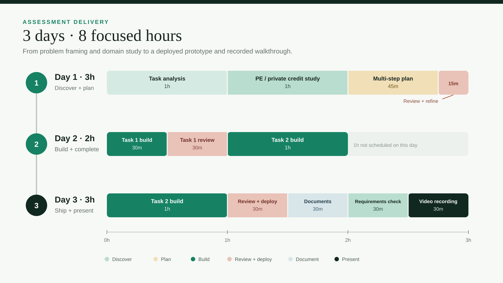
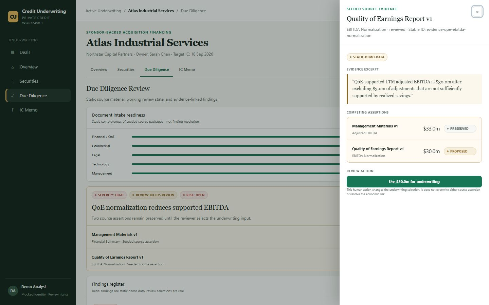
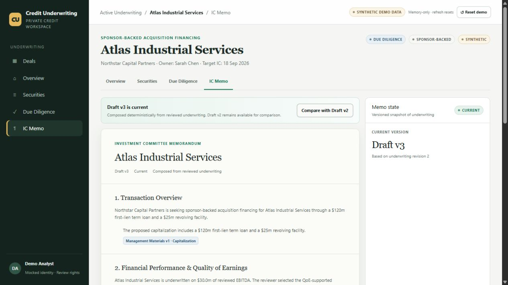

# Private Credit Underwriting Demo

An evidence-first private credit prototype that connects Deals, Securities, Due Diligence, and IC Memo through one governed Atlas Industrial Services workflow.

All companies, documents, terms, figures, and evidence excerpts are synthetic. The app has no client-system access and makes no autonomous investment decision.

**Live demo:** [private-credit-underwriting-demo-kappa.vercel.app](https://private-credit-underwriting-demo-kappa.vercel.app/deals)

## Development timeline

The assessment was completed across three focused sessions totaling eight hours.



## Demo walkthrough

1. Open **Atlas Industrial Services** from the three-deal pipeline.
2. Review the conflicting $33.0m management and $30.0m QoE EBITDA assertions.
3. In Due Diligence, open the seeded QoE excerpt and select **Use $30.0m for underwriting**.
4. Verify the code-owned calculations update across Overview and Securities: leverage 4.00x to 4.40x, downside leverage 5.00x to 5.50x, and modeled covenant headroom 0.75x to 0.25x.
5. In IC Memo, compare the immutable Draft v2 snapshot, then update to evidence-linked Draft v3.

`Reset demo` or a full refresh restores the initial state.

## Prototype truth ledger

| Classification | Scope |
|---|---|
| **REAL** | Navigation; evidence review; human selection; finance; state propagation; audit; memo staleness, comparison, composition, and citations; reset. |
| **MOCKED** | Signed-in Demo Analyst identity and review rights. |
| **STATIC DEMO DATA** | Three deals, document excerpts, source assertions, findings, securities, and Draft v2 prose. |
| **NOT IMPLEMENTED** | Live ingestion or model calls, persistence, real authentication/permissions, client-system adapters/connectors, full covenant parsing, and autonomous recommendations. |

## Assessment material

- [Task 1 — Private Equity Memo Intelligence](TASK_1.md): client discovery questions, a focused 24-hour demo proposal, explicit mock and ignore boundaries, and the principal trust risk.
- [Task 2 — System explanation](SYSTEM_DESIGN.md): architecture, data model, tradeoffs, and the next two days of work for the private credit prototype.
- [Task 2 — Two-page system explanation (PDF)](outputs/system-explanation.pdf)

## Run locally

Requires Node.js 24.

```bash
npm install
npm run dev
```

Open `http://localhost:3000/deals`.

## Verify

```bash
npm run typecheck
npm run lint
npm test
npm run build
npm audit --omit=dev
```

The test suite covers the exact finance outputs, invalid inputs, conflicting source preservation, human review transitions, reset behavior, immutable memo versions, evidence links, and validated memo contracts.

The production dependency audit reports zero vulnerabilities. A full development-tool audit still reports advisories inherited through the Vinext/Vite/Cloudflare toolchain; resolving those currently requires forced, out-of-range upgrades, so they are intentionally isolated from the shipped runtime instead of being hidden behind an unsafe upgrade.

## Architecture and system explanation

- [System explanation](SYSTEM_DESIGN.md)
- [Two-page system explanation (PDF)](outputs/system-explanation.pdf)
- [Architecture source](docs/architecture.mmd)
- [Rendered architecture](docs/architecture.png)

The prototype is a small Next.js/TypeScript monolith with memory-only reducer state, pure finance functions, and one validated deterministic memo endpoint. Domain records keep semantic provenance (`semanticOrigin`) separate from how the demo produced them (`materializationSource`), so seeded source observations cannot be mistaken for live extraction. The production direction retains the same domain contracts while adding immutable document storage, durable reviewed underwriting state, constrained extraction/drafting, permissions, audit persistence, and client-specific adapters. Those adapters are a production boundary, not a prototype mock.

## Screens




