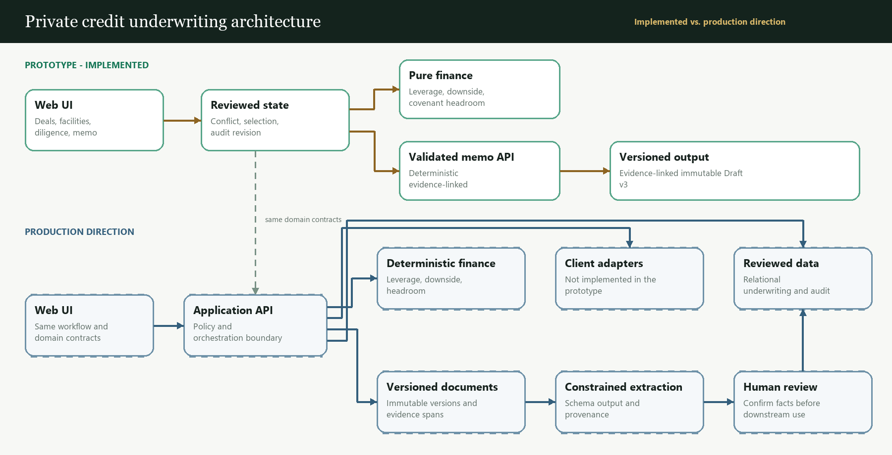

# Private Credit Underwriting System Explanation

> All companies, documents, terms, and evidence excerpts in this prototype are synthetic.

## 1. What I built

I built a governed private-credit workspace connecting Deals, Securities, Due Diligence, and IC Memo through one reviewable Atlas Industrial Services workflow.

Management asserts $33.0m EBITDA; the QoE supports $30.0m. Both assertions remain visible. After reviewing the QoE evidence, the Demo Analyst selects **Use $30.0m for underwriting** without overwriting either source. Pure functions then update base leverage (4.00x → 4.40x), 20% downside EBITDA ($26.4m → $24.0m), downside leverage (5.00x → 5.50x), and headroom to the synthetic 5.75x covenant (0.75x → 0.25x). Reviewed state propagates across the workspace, creates an audit event, and marks Draft v2 **Out of date**. **Update memo from reviewed underwriting** creates immutable, evidence-linked Draft v3.

The product supports—not replaces—investment judgment. The sellable hypothesis is that resolving a material source conflict once, then propagating the reviewed value through facility metrics and the IC memo, reduces re-keying and improves underwriting consistency while returning reviewer time.

## 2. Architecture

The architecture figure embedded in the PDF is generated from the canonical [Mermaid architecture source](docs/architecture.mmd).

Fixtures and memory-only reducer state keep the prototype reliable. Pure functions—not prose generation—calculate finance. A validated memo endpoint deterministically composes v3; there is no live model call. In production, immutable document versions feed schema-constrained extraction, provenance, and human review. Reviewed structured data is the system of record; the memo is a versioned view. Client-specific repository and deal-system adapters are production direction only; none is implemented or simulated in this prototype.

## 3. Data model

- Deal-related records include `Security`, `Document`, `DiligenceItem`, `Finding`, `MemoVersion`, and `AuditEvent`, linked by deal ID. The $120m term loan and $25m revolver are separate Securities.
- `DocumentVersion` is immutable. `Evidence` identifies its document version, section, and excerpt; seeded text has no fabricated page numbers.
- `SourceAssertion` records a value, unit, `semanticOrigin`, `materializationSource`, and evidence. Conflicts coexist. Separate assertions also source the $132m net-debt and 5.75x covenant inputs, and composition rejects any drift from those cited observations. `UnderwritingSelection` is the canonical reviewed EBITDA state: it references the selected assertion and advances revision 1 to revision 2 without rewriting sources.
- `Finding` is the prototype's structured risk/mitigant record. Findings can reference multiple Evidence records, and Evidence can support multiple findings. The UI projects the QoE finding's review state from the canonical selection, so it becomes Confirmed while severity remains High and economic status remains Open.
- `MemoVersion` records the selection ID and underwriting revision it used; `MemoClaim` links back to Evidence. `AuditEvent` captures actor, action, time, and before/after selection state. `semanticOrigin` describes meaning (`source_observation`, `system_composed`, or human/model states); `materializationSource` separately discloses whether a record came from `static_demo_data` or runtime code.

## 4. Tradeoffs and prototype truth ledger

| Classification | Included scope |
|---|---|
| **REAL** | Navigation; source conflict/evidence; human selection; finance and state propagation; audit; memo staleness, immutable comparison/composition, evidence links; reset. |
| **MOCKED** | Signed-in Demo Analyst identity and review rights. |
| **STATIC DEMO DATA** | Three deals, document excerpts, initial assertions, findings, securities, and most v2 prose. |
| **NOT IMPLEMENTED** | Live ingestion/model calls, persistence, real auth/permissions, client-system adapters/connectors, full covenant/spreadsheet parsing, multitenancy, and production operations. |

State intentionally resets on refresh. I simplified ingestion and persistence with seeded fixtures and memory-only state. I mocked only the signed-in analyst. I ignored post-close monitoring and servicing because they do not prove the underwriting-to-IC path.

For this publicly accessible take-home demo, I deliberately used a **deterministic, rule-based memo composer instead of connecting the application to a live LLM API**. This keeps the walkthrough reproducible and avoids exposing an unauthenticated generation endpoint to abuse and uncontrolled provider cost. In production, the same validated service boundary could invoke a schema-constrained model behind server-side authentication, authorization, quotas, and audit, while finance calculations and investment approval remain deterministic and human-controlled.

## 5. What I would add with two more days

**Day 1 — Constrained ingestion + durable reviewed state**

- **Morning (1/2 day):** accept text-native PDFs, create immutable document versions with page- and section-level evidence, and route scanned or unsupported files to **Needs Review** rather than guessing.
- **Afternoon (1/2 day):** persist assertions, selections, findings, evidence links, append-only audit events, and memo versions. **Done means:** a refresh no longer resets the analyst's selection, and the $33.0m/$30.0m conflict remains fully traceable.

**Day 2 — Evaluated model path + operational guardrails**

- **Morning (1/2 day):** add one schema-constrained extraction and drafting path behind the existing service boundary, with golden fixtures, evidence-reference validation, and rejection of unsupported claims.
- **Afternoon (1/2 day):** add provider timeout/retry handling, deterministic fallback, and reviewer accept/edit/reject telemetry. **Done means:** the Atlas workflow survives a provider failure, every generated claim remains evidence-linked, and the model never calculates finance or approves an investment decision.
